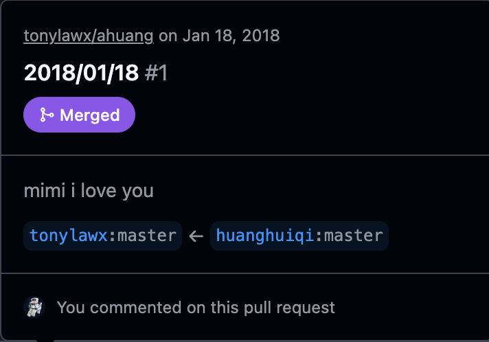

# 啊黄，做我女朋友吧 🎵

一个用代码写成的表白网页 —— 滑动屏幕逐句看完告白，背景循环播放陈奕迅《陪你度过漫长岁月》。

<div align="center">



</div>

## 🌐 在线访问

> 打开页面后，**轻触/点击屏幕**即可开始播放背景音乐并继续翻页。

**地址：** https://ahuang-beta.vercel.app

<div align="center">


*手机扫码直接访问*

</div>

## ✨ 功能

- 逐屏文字告白动画（共 16 句）
- 点击触发背景音乐播放（陈奕迅《陪你度过漫长岁月》），循环播放
- 飘雪特效

## 🚀 技术栈

- 纯静态站点（HTML + CSS + jQuery）
- 部署于 [Vercel](https://vercel.com)

## 📦 部署

本项目已配置 [`vercel.json`](./vercel.json)，确保音频文件以正确的 `Content-Type: audio/mpeg` 及 `Accept-Ranges: bytes` 响应，保证 MP3 在各端可正常播放与拖动进度。

```bash
# 安装 Vercel CLI
npm i -g vercel

# 一键部署
vercel --prod
```

## 📁 项目结构

```
.
├── index.html      # 表白主页
├── bgm.mp3         # 背景音乐（陪你度过漫长岁月）
├── vercel.json     # Vercel 部署配置（含 MP3 响应头）
├── qrcode.png      # 访问二维码
├── snow2.js        # 飘雪特效
├── jquery-3.0.0.min.js
└── ...
```

---

&copy; 你的咪咪
